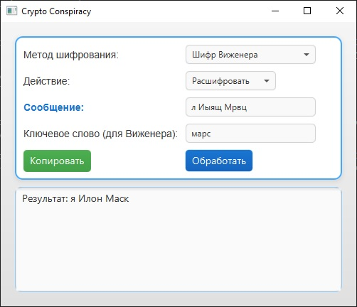

# CryptoConspiracy

A JavaFX application for encrypting and decrypting messages with a "conspiracy" twist. It supports multiple encryption methods and features a modern light-themed graphical interface.

## Description
CryptoConspiracy is a JavaFX application that allows users to encrypt and decrypt messages using various encryption methods. After encryption, a random "conspiracy" phrase is added for a humorous effect. The application features a modern graphical interface with accent colors and a copy-to-clipboard functionality.

## Features
- Encrypt and decrypt messages using three methods:
    - Caesar Cipher
    - Transposition Cipher
    - Vigenère Cipher (with a keyword)
- Supports both English and Russian alphabets.
- Adds random "conspiracy" phrases after encryption (e.g., "The government is hiding the truth!").
- Modern JavaFX graphical interface with a light theme and accent colors.
- Copy-to-clipboard button for easy result sharing.

## Screenshot

## Requirements
- Java 17 or higher.
- JavaFX SDK (version 24 recommended).

## Installation and Running
1. Clone the repository:git clone https://github.com/Shender-I/CryptoConspiracy.git
2. Download the `CryptoConspiracy.jar` from the [Releases](https://github.com/Shender-I/CryptoConspiracy/releases) section.
3. Ensure you have Java 17+ and JavaFX installed:
- Download Java from [Oracle](https://www.oracle.com/java/technologies/downloads/).
- Download JavaFX from [Gluon](https://gluonhq.com/products/javafx/).
4. Run the application using the following command (replace `path\to\javafx-sdk\lib` with the path to your JavaFX `lib` folder):
java --module-path "path\to\javafx-sdk\lib" --add-modules javafx.controls,javafx.fxml -jar CryptoConspiracy.jar
Example (Windows): "C:\Program Files\Java\jdk-23\bin\java" --module-path "C:\JavaFX\javafx-sdk-24\lib" --add-modules javafx.controls,javafx.fxml -jar CryptoConspiracy.jar

## Usage
1. Launch the application using the command above.
2. Select an encryption method (Caesar, Transposition, or Vigenère).
3. Choose an action (Encrypt or Decrypt).
4. Enter your message.
5. If using Vigenère, provide a keyword.
6. Click "Process" to see the result.
7. Use the "Copy" button to copy the result to your clipboard.

## Example
**Input:**
- Message: SECRET
- Method: Vigenère Cipher
- Keyword: CODE
- Action: Encrypt

**Output:**
- Result: AFOTCY [Conspiracy Revealed]: The government is hiding the truth!

## Technologies Used
- Java 23
- JavaFX 24
- IntelliJ IDEA

## Project Structure
- `src/`: Source code (Java files, FXML, CSS).
- `out/artifacts/CryptoConspiracy_jar/`: Compiled JAR file.